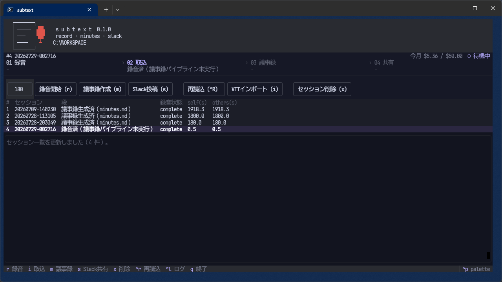

<p align="center">
  
</p>

<h1 align="center">Subtext</h1>

<p align="center">
  Web 会議に bot を参加させず、自分の PC の OS 音声層から音声を取得し、<br>
  会議後にクラウド処理で議事録（<code>minutes.md</code>）を作って Slack へ流すツール。
</p>

<p align="center">
  <code>Windows</code> ・ <code>C# (.NET 10)</code> ・ <code>Python 3.13 / uv</code> ・ <code>AWS Transcribe + Bedrock</code>
</p>

<p align="center">
  
</p>

---

## これは何か

会議サービスに bot を招待する方式を取らず、**自分の PC の音声（マイク＝自分／スピーカー出力＝相手）** を WASAPI で 2 系統に分けて録り、会議後に文字起こし・要約して議事録を作ります。
録音・取込・議事録生成・Slack 投稿は、1 画面の TUI（`uv run meeting tui`）からまとめて操作できます。

実装は疎結合な 3 ユニットと、それらを駆動するハーネスに分かれています。

| ユニット | 役割 | 実装 | 場所 |
|----------|------|------|------|
| **Unit A** | 音声キャプチャ / 録音（マイク・ループバックの 2 系統を同期録音） | C# / net10.0-windows | `src/capture`, `src/recorder` |
| **Unit B** | 会議後パイプライン（Transcribe 話者分離 → 要約 → `minutes.md`） | Python 3.13 | `src/postmeeting` |
| **Unit C** | ライブ字幕（会議中のリアルタイム確認。任意） | C# / Transcribe Streaming | `src/live` |
| **会議ハーネス** | 上記の駆動（CLI `meeting` と TUI）・課金台帳・Slack 投稿 | Python 3.13 | `tools/meeting` |

ユニット間の連携は**保存ファイルの受け渡しだけ**です（WAV ＋ サイドカーメタ JSON ＋ `manifest.json`、および最終トランスクリプト JSON）。
共有ライブラリも共有設定も持ちません（FR-16。連携契約は [docs/design/02-アーキテクチャ.md](docs/design/02-アーキテクチャ.md)）。

議事録の入口は 3 通りあります（これから録音する／Teams 等が出した字幕 `.vtt` がある／録画 `.mp4` しかない）。
会議中にライブ字幕（Unit C）を流していた場合は、その記録も 4 つめの入口になります（設計書はこれを含めて「4 つの入口」と数えます）。
どの経路でも「`spk_0` は誰の発言か」を人間が確定するまで議事録を作らせません。
経路の選び方と操作手順は [docs/会議議事録作成マニュアル.html](docs/会議議事録作成マニュアル.html)、設計上の根拠は [docs/design/](docs/design/) にあります。

---

## 開発を始める

### 前提

| | 用途 |
|---|---|
| **Windows 11** | 必須。Unit A / C が WASAPI に依存するため |
| **[uv](https://docs.astral.sh/uv/)** | 必須。Python 3.13 は `.python-version` で固定される（Python の事前導入は不要） |
| **PowerShell 7（`pwsh`）** | 必須。`scripts/*.ps1` の実行に使う。Windows 標準の `powershell.exe`（5.1）とは別物 |
| **.NET 10 SDK** | Unit A / C をビルド・テストするなら必須。Python 側だけ触るなら不要 |
| **AWS アカウント** | 文字起こし・要約を実際に走らせるなら必須。字幕（`.vtt`）＋ `--no-summarize` は完全ローカルで動く |
| **ffmpeg** | 録画 mp4 経路を試すときのみ（PATH 上に置く） |

### セットアップ

すべて**リポジトリルート**（`Subtext.sln` のある階層）で実行します（`cd` は不要）。

```bash
pwsh -NoProfile -File scripts/bootstrap.ps1     # PowerShell 7 必須（Windows 標準の 5.1 では動きません）
#   → uv sync（postmeeting + meeting を単一 .venv へ。3.13 は .python-version で固定）→ .env 準備 → data/ 作成
```

AWS を使う場合は、ルートの `.env` に `S3_BUCKET` と `BEDROCK_MODEL_ID` を設定します。
**認証情報は `.env` に書きません**（AWS プロファイル / SSO で通す）。

### ビルドとテスト

```bash
dotnet build Subtext.sln -c Release
dotnet test  Subtext.sln --collect:"XPlat Code Coverage"

uv run pytest src/postmeeting      # Unit B
uv run pytest tools/meeting        # 会議ハーネス（CLI / TUI）

# 単一テストクラス・メソッドに絞る
dotnet test tests/Subtext.Recorder.Tests --filter "FullyQualifiedName~SyncMathTests"
```

C# 側のテストは WASAPI 実機を必要としない純粋ロジック（正規化・同期計算・モデルの round-trip など）に寄せてあります。
実機を差し替える継ぎ目は `IAudioCapture` と `SyncRecorder.RecordAsync` の `startUtcOverride` の 2 か所です。

### 動かす

```bash
uv run meeting tui
```

> 録音は**通常のターミナル**から起動してください（Claude Code のセッション内からは WASAPI を掴めません）。

### 運用専用機へ配る

self-contained で publish すると、配布先に **.NET SDK が不要**になります。

```bash
pwsh -NoProfile -File scripts/publish.ps1     # → dist/recorder, dist/live
```

TUI（会議ハーネス `tools/meeting`）は publish の対象外です。
**uv とリポジトリ一式は配布先にも必要**で、起動時に `Subtext.sln` を目印にルートを解決し `tools/meeting/meeting.toml` を読みます（[docs/design/06-会議ハーネス.md](docs/design/06-会議ハーネス.md)）。

運用専用機の用意はこの順で行います。

```powershell
# 1. uv を入れる（Python 本体は uv が持ってくる）
winget install astral-sh.uv

# 2. リポジトリ一式を配置する（Subtext.sln を含む。uv workspace の両メンバーが必要）
#    zip やファイル共有で渡した場合は、実行前に Mark-of-the-Web を外す
Unblock-File -Path scripts\*.ps1

# 3. セットアップ（uv sync → .env 雛形 → data/ 作成）
pwsh -NoProfile -File scripts/bootstrap.ps1

# 4. ビルド機で作った dist/ をリポジトリルート直下へコピーする
#    → 会議ハーネスが dist/recorder（録音）と dist/live（ライブ字幕）を自動で優先参照する

# 5. .env に S3_BUCKET / BEDROCK_MODEL_ID（Slack を使うなら SLACK_BOT_TOKEN）を記入

# 6. 通常のターミナルから起動
uv run meeting tui
```

> Unit B（議事録）は `dist/` に含みません。`uv sync` で `.venv` に入るものを
> `uv run subtext-postmeeting` で起動します。

---

## リポジトリ構成

```text
subtext/
├── src/
│   ├── capture/        # Unit A: WASAPI キャプチャ（C# クラスライブラリ。Unit A/C 共用）
│   ├── recorder/       # Unit A: 録音オーケストレーション（C# CLI）
│   ├── postmeeting/    # Unit B: 会議後パイプライン（Python。3 つの CLI を提供）
│   └── live/           # Unit C: ライブ字幕（C#）
├── tests/              # xUnit（Subtext.Recorder.Tests / Subtext.Live.Tests）
├── tools/
│   ├── meeting/        # 会議ハーネス（CLI `meeting` + TUI）
│   ├── correction/     # 用語補正の辞書（terms.json）
│   ├── verify/         # 録音・議事録の検証補助
│   └── vocab/          # カスタム語彙管理（任意）
├── infra/              # AWS CDK（重いため uv workspace には含めない。デプロイ時のみ個別に sync）
├── scripts/            # bootstrap / publish
├── docs/               # 設計書（design/）・運用マニュアル・言語別コーディング規約
├── assets/             # アイコン・画面イメージ
├── data/               # 録音と議事録の入出力（gitignore）
└── Subtext.sln
```

---

## 変更するときの約束

- **トレーサビリティコード**：コメント中の `FR-xx` / `BR-xxx-xx` / `NFR-SEC-xx` / `Qn=A` は設計書を参照する識別子です。コードを変えたら対応する設計書とコメントの ID 整合を保ちます。定義の一次情報は [付録-トレーサビリティ.md](docs/design/付録-トレーサビリティ.md) です。
- **依存はバージョン完全固定**（NFR-SEC-05）。NuGet 参照に範囲指定を書かず、公式レジストリのみを使います。
- **秘密を直書きしない**（BR-SEC-01）。音声や実名はローカルに留め、ログにも出しません。
- 設計・要件が動く変更では、先に該当する設計書を更新します。

設計の一次情報は [docs/design/](docs/design/) です。
作業時の規約とコマンドは [CLAUDE.md](CLAUDE.md) にまとめてあります。

---

## ドキュメント

| ドキュメント | 内容 |
|--------------|------|
| [docs/design/](docs/design/) | 設計書。概要とスコープ、アーキテクチャ、各ユニット設計、インフラ、追加機能、リスクとセキュリティ方針、FR/BR/NFR/Q の全定義表、用語集 |
| [docs/会議議事録作成マニュアル.html](docs/会議議事録作成マニュアル.html) | 運用担当者向けの操作手順。TUI を主経路に、経路 A/B/C・話者名・Slack・コスト・トラブルシューティングまで。**ブラウザで開く**（印刷・PDF 配布も想定した単一 HTML） |

---

## データの取り扱い

音声・実名などの個人情報は、ローカルと自社 AWS に留めて外部へ出さないことを既定にしています（BR-SEC-02）。
議事録の文章化だけは Bedrock（自社 AWS 内）と Claude 生成（Anthropic へ送信）から選べるため、**どちらを使うかは情報の取り扱い方針で決めてください**。
判断材料と既定値は [docs/design/09-リスクとセキュリティ方針.md](docs/design/09-リスクとセキュリティ方針.md) と [.claude/skills/subtext-meeting/SKILL.md](.claude/skills/subtext-meeting/SKILL.md) にあります。
